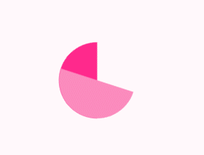

# IFE-2017

> 记录在2017百度前端学院里的收获。


## 流彩文字效果+图片模糊效果+边框伸展效果实现简述
> 由任务的效果图进行分析，主要特效在于三处，也即标题所述（“点击报名”可以用CCS3 animation循环改变`color`属性值实现，不表）。

### 文字流光效果
* 下述方案适合于webkit内核的浏览器（Safari、Chrome）。

#### 方案1
最明显的变化是文字的颜色，似乎有跑马灯的效果，但细看之下并非每个字的颜色单独改变，而是在文字的框架之下似有色彩流动，不禁让人想到PS中蒙板的效果。故第一个方案是借助`mask-image`属性，将另外一个盒的背景设置为渐变色，再作为原文字的蒙板。

#### 方案2
 方案二几乎是在模仿蒙板操作：
 1. 将渐变色设置为文字所在盒的背景色：` background-image: linear-gradient(...)`
 2. 取文字的形状与背景（长方形）的交集：`-webkit-background-clip: text`
 3. 删除覆盖在得到交集之上的原文字形状：`-webkit-text-fill-color: transparent`

在经过上述步骤后得到了渐变色填充文字的效果，但实则呈现的是经过裁剪之后的背景，故要实现色彩的流动，则需要背景进行循环地流动，则可使用CSS3 animation循环改变background-position可破之，但在动画效果上有两坑需要注意：
1. `background: linear-gradient(...)`是多个属性的简写，在@keyframes中修改某项的值请使用具体的属性，否则若使用简写则会覆盖之前的设置。
2. 初始设置背景时需要设置`background-size-x`>100%。原理尚不清楚，但如若不写，则渐变色则静止不动，即使设置`background-repeat: repeat-x`也毫无作用。经测试，不论背景为图片还是渐变色，必须要本身的尺寸大于盒的尺寸设置`background-position`才有效。

参考： [小tip:CSS3下的渐变文字效果实现](http://www.zhangxinxu.com/wordpress/2011/04/%E5%B0%8Ftipcss3%E4%B8%8B%E7%9A%84%E6%B8%90%E5%8F%98%E6%96%87%E5%AD%97%E6%95%88%E6%9E%9C%E5%AE%9E%E7%8E%B0//)
### 图片模糊效果
可使用CSS滤镜、SVG滤镜、Canvas实现，详情可参考[小tip: 使用CSS将图片转换成模糊(毛玻璃)效果](http://www.zhangxinxu.com/wordpress/2013/11/css-svg-image-blur/)。

### 边框伸展效果
乍看之下，四条border分别伸展，而对于border我们能设置的属性只有width、color、style，其长度由盒的长宽决定。细看之下，其边的伸展可以分为[上,下]和[左,右]两组，也即我们可以用两个盒子的宽高变化来模拟示意图中的效果，每个盒子负责两条相对的边。在此处我没有选择在html中附加两个div来实现效果，这不符合语义化的原则。思前想后，可以使用`::before`和`::left`两个伪类选择器来实现。伪类选择器添加的盒（包裹content的）只在CSS渲染层，而不在DOM中，故此处可以使用这两个盒的四条边来配合`transition`和`:hover`来实现图示效果。
当设置如下时：
```
.border-connect:before,.border-connect:after{
    content:" ";
    display: block;
    position: absolute;
    width: 100%;
    height: 100%;
    border: 4px solid black;
}
```
会有如图所示的效果

两个盒子的位置如图所示，剩余的工作没有太多难点。惟一需要注意的地方是图示的边框动画是从中部向外延伸的，故两个盒的起始位置都应在对应边的中部，可以想象为呈“田”字状，也即最初负责上下两条边动画的盒的`left`应为50%，余者同理。

demo页地址：http://codepen.io/XXXXat/pen/JWoJGr

## CCS3饼状Loading效果
### 纯CSS实现圆形/半圆/弧形
* 将`border-radius`设置为正方形div的长度的一半可得到原型或者圆弧。
* 将两个半圆拼凑成一个正圆。
* 设置`width`和`height`设置为0，设置`border-width`和`border-radius`为圆的半径，通过设置每条border的颜色可以改变每个直角扇形的颜色，同理可以组合形成半圆、270°扇形。例如为一个div设置css样式如下：

```

#div{
  width: 0;
  height: 0;
  border: 100px solid;
  border-radius: 100px;
  border-top-color: lightgreen;
  border-right-color: deepskyblue;
  border-bottom-color: dodgerblue;
  border-left-color: royalblue;
}
```
则有如下效果：


* 通过`clip-path`可产生圆形、以矩形的四边为直径的半圆、以矩形的四边为弦的弓形。
* 通过设置盒的非对角的`border-radius`为所夹边长度的一半，则可得到以矩形的四边为直径的半圆。
* ​

### Loading效果实现思路
观察效果图得知，整体效果可以分为两部分，首先是外层的四分之三弧线的旋转，以及内层的较为复杂的旋转。
由于弧长为圆周的3/4，则可采用前部分所述的第一种方法，设置某条边的`border-color`为`transparent`即可。旋转则使用CSS3 Animation配合`transform`即可。
内层较为复杂的旋转可以分为两层效果来实现，最底层为一个如图所示的正圆：


在其上有两个颜色各异的半圆在进行如图所示的旋转（单个周期）：



即可实现示意图中的效果。

* bug：在竖直方向上浅色半圆和底部完整的圆形会有一条1px的偏差无法调整，初步估计其中涉及到border的渲染机制，若关于此有任何建议，请不吝赐教。